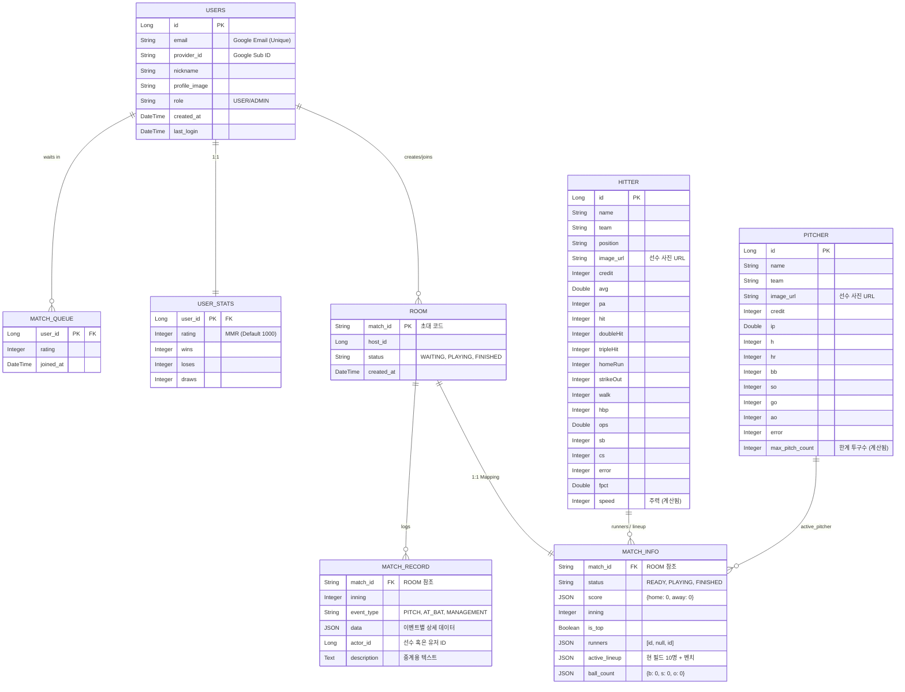

# ⚾ K-Baseball Director 통합 개발 문서

## 🗄️ 1. 데이터베이스 스키마 (DB Schema)

### **ERD 다이어그램 (Mermaid)**



---

## 🚀 2. API 명세서

### **1) 친구초대**

| 기능 | Method | End-point |
| --- | --- | --- |
| 방 생성 (친구초대) | `POST` | `/api/rooms` |
| 방 참가 (코드입력) | `POST` | `/api/rooms/join` |
| 랜덤 매칭 시작 | `POST` | `/api/matchmaking` |
| 매칭 상태 확인 | `GET` | `/api/matchmaking/status` |

#### **상세 예시**

* **`POST /api/rooms`**

```json
// request
{ "user_id": 1 }
// response
{ "match_id": "AB1234", "status": "WAITING" }

```

* **`POST /api/rooms/join`**

```json
// request
{ "match_id": "AB1234", "guest_id": 1021 }
// response
{ "match_id": "AB1234", "status": "PLAYING" }

```

---

### **2) 핵심 기능: 라인업 빌더, 경기 셋업 (`/api/team`)**

| 기능 | Method | End-point |
| --- | --- | --- |
| 선수 엔트리 조회 | `GET` | `/api/team/players` |
| 라인업 저장 | `POST` | `/api/team/lineup` |
| 크레딧 밸런스 체크 | `GET` | `/api/team/lineup_check` |
| 경기 설정 확정 | `POST` | `/api/team/match_setup` |

#### **상세 예시**

* **[GET] 선수 엔트리 조회**

```json
// response : 타자, 투수 테이블 컬럼 그대로 반환
{
  "hitters": [
    { "id": 1, "name": "노시환", "team": "한화", "position": "3B", "credit": 85, "avg": 0.298, "ops": 0.920, "homeRun": 31, "error": 12 },
  ],
  "pitchers": [
    { "id": 50, "name": "문동주", "team": "한화", "credit": 90, "ip": 118.2, "so": 95, "bb": 52, "error": 1 }
  ]
}

```

* **[POST] 라인업 저장**

```json
// request body 
{
  "match_id": "AB1234",
  "active_lineup": {
    "starters": {
      "P": 50, "C": 12, "1B": 5, "2B": 3, "3B": 1, "SS": 7, "LF": 9, "CF": 11, "RF": 8, "DH": 21
    }, 
    "batting_order": [21, 11, 1, 5, 8, 9, 3, 7, 12],
    "bench": [15, 18, 22, 30],
    "bullpen": [51, 55, 60]
  }
}

```

---

### **3) 게임 엔진 시뮬레이션 (`/api/simul/`)**

#### **REST API**

| 기능 | Method | End-point |
| --- | --- | --- |
| 경기 초기 load | `GET` | `/api/simul/{id}/init` |

* **[GET] `/api/simul/{id}/init` response 예시**

```json
{
  "match_id": "AB1234",
  "status": "READY",
  "score": { "home": 0, "away": 0 },
  "inning": 1,
  "is_top": true,
  "runners": [null, null, null],
  "ball_count": { "b": 0, "s": 0, "o": 0 },
  "active_lineup": { ... }
}

```

#### **WebSocket**

* **Endpoint:** `/ws-baseball`
* **Subscribe URL:** `/topic/match/{matchId}`
* **Publish URL:** `/app/match/{matchId}/command`

##### **[A] 서버 -> 클라이언트 (브로드캐스팅)**

| 메시지 타입 | 발생 시점 | UI 액션 |
| --- | --- | --- |
| `PITCH_RESULT` | 공 한 개 투구 시 | 볼카운트/궤적 갱신 |
| `AT_BAT_RESULT` | 타석 종료 시 | 결과 팝업/주자 이동 |
| `GAME_EVENT` | 이닝/경기 종료 시 | 전환 컷신/최종 점수판 |
| `ERROR` | 오류 발생 시 | 토스트 메시지 알림 |

* **`PITCH_RESULT` 상세**

```json
{
  "event_type": "PITCH",
  "inning": 1,
  "description": "류현진의 2구째 스트라이크!",
  "data": {
    "pitcher_id": 50,
    "pitch_type": "SLIDER",
    "velocity": 142,
    "result": "STRIKE",
    "ball_count": { "b": 1, "s": 2, "o": 0 }
  }
}

```

* **`AT_BAT_RESULT` 상세**

```json
{
  "event_type": "AT_BAT",
  "inning": 1,
  "description": "노시환, 좌측 담장 넘기는 홈런!",
  "data": {
    "batter_id": 1,
    "result": "HIT",
    "detail": "HOMERUN",
    "score_change": 1
  }
}

```

##### **[B] 클라이언트 -> 서버 (커맨드)**

| 메시지 타입 | 내용 | 비고 |
| --- | --- | --- |
| `TACTIC` | 번트, 도루, 고의 사구 | 확률 가중치 반영 |
| `SUBSTITUTION` | 선수 교체 | 즉시 갱신 및 응답 |

* **`TACTIC` 예시 (도루 지시)**

```json
{
  "command": "STEAL",
  "base_number": 1,
  "description": "1루 주자에게 도루 작전이 내려졌습니다."
}

```

* **`SUBSTITUTION` 예시 (투수 교체)**

```json
{
  "command": "CHANGE_PITCHER",
  "out_player_id": 50,
  "in_player_id": 77,
  "description": "투수 교체: 문동주 -> 주현상"
}

```

---

### **4. 결과 및 하이라이트 (`/api/match`)**

| 기능 | Method | End-point |
| --- | --- | --- |
| 결과 요약 | `GET` | `/api/match/{id}/summary` |
| 상세 박스스코어 | `GET` | `/api/match/{id}/stats` |
| 하이라이트 로그 | `GET` | `/api/match/{id}/highlights` |

#### **상세 예시**

* **결과 요약 response**

```json
{
  "match_id": "AB1234",
  "status": "FINISHED",
  "start_time": "2026-01-24T14:00:00",
  "end_time": "2026-01-24T17:30:00",
  "teams": {
    "home": { "team_name": "한화", "score": 5, "is_winner": true },
    "away": { "team_name": "LG", "score": 3, "is_winner": false }
  },
  "key_players": {
    "win_pitcher": { "id": 50, "name": "문동주" },
    "lose_pitcher": { "id": 88, "name": "임찬규" },
    "mvp": { "id": 1, "name": "노시환", "reason": "9회말 끝내기 2점 홈런" }
  }
}

```

* **상세 박스스코어 response**

```json
{
  "home_stats": {
    "hitters": [
      { "name": "노시환", "position": "3B", "pa": 4, "hit": 2, "homeRun": 1, "strikeOut": 1, "avg": 0.500 },
      { "name": "채은성", "position": "1B", "pa": 4, "hit": 0, "homeRun": 0, "strikeOut": 2, "avg": 0.000 }
    ],
    "pitchers": [
      { "name": "문동주", "ip": 7.0, "h": 4, "so": 8, "bb": 2, "er": 1 },
      { "name": "주현상", "ip": 2.0, "h": 1, "so": 3, "bb": 0, "er": 0 }
    ]
  },
  "away_stats": { ... }
}

```

* **하이라이트 로그 response**

```json
{
  "match_id": "AB1234",
  "highlights": [
    {
      "inning": 1,
      "event_type": "AT_BAT",
      "description": "노시환, 선제 솔로 홈런!",
      "data": { "batter_id": 1, "result": "HIT", "detail": "HOMERUN", "score_change": 1 }
    },
    {
      "inning": 7,
      "event_type": "MANAGEMENT",
      "description": "투수 교체: 문동주 -> 주현상",
      "data": { "command": "CHANGE_PITCHER", "out_player_id": 50, "in_player_id": 77 }
    }
  ]
}

```